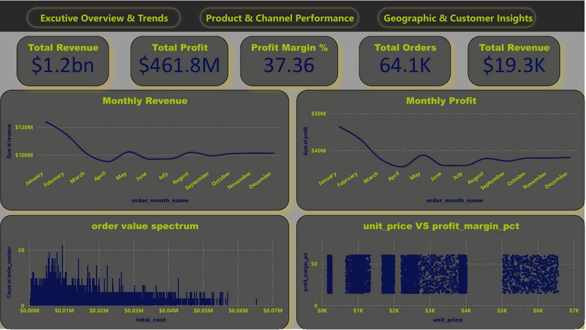
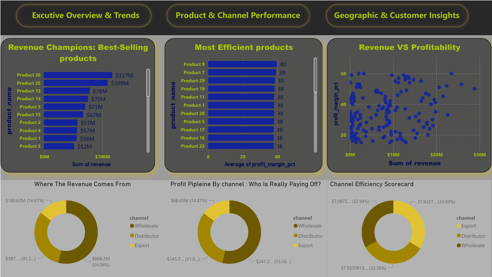
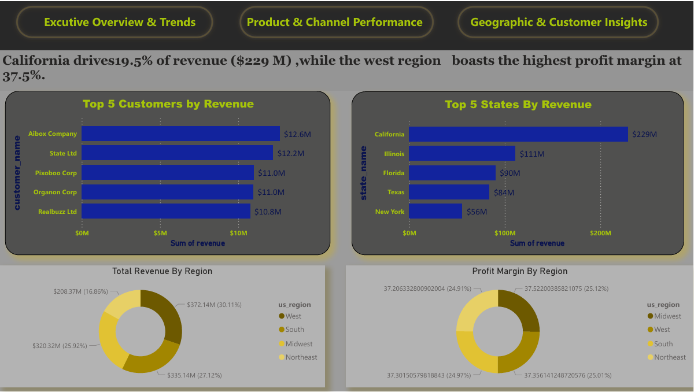

# 📊 USA Regional Sales Analysis


## 🗂️ Project Summary
This project performs **Exploratory Data Analysis (EDA)** on **Acme Co.’s 2014–2018 USA Sales Dataset** to identify revenue & profit drivers, seasonal patterns, and customer segmentation.  
Findings from this analysis will be used to design a **Power BI dashboard** to support data-driven strategic decisions.

> ⚠️ **Note:** This project was created as a **learning exercise** by following a tutorial and then implementing it from scratch to understand the full workflow of data cleaning, EDA, and visualization.

## ❓ Problem Statement
Analyze Acme Co.’s historical sales data to:
- Identify top-performing products, channels, and regions driving revenue & profit.
- Detect seasonal trends and demand anomalies.
- Assess outliers impacting pricing and margin.
- Inform pricing, promotions, and market expansion strategies.

## 🎯 Objectives
- Deliver actionable insights to support **sustainable growth**.
- Build a foundation for an **interactive Power BI dashboard**.
- Provide a reusable pipeline for sales analysis.

## 📂 Dataset Description
- **Sales Orders:** Transaction-level sales data (2014–2018)
- **Customers:** Customer demographic and segmentation info
- **Products:** Product catalog and unit pricing
- **Regions:** U.S. regional and state mapping
- **Budgets:** 2017 budget targets for performance comparison

## 🔍 Exploratory Data Analysis (EDA)
- ✅ Data profiling & cleaning (missing values, data types)
- ✅ Merging multiple sheets into a single clean DataFrame
- ✅ Feature engineering: profit, margin %, monthly trends
- ✅ Outlier detection on revenue & unit price

## 📊 Key Visualizations
- 📈 **Monthly Sales Trends** (Revenue seasonality)
- 🛒 **Top Products** (Revenue & Avg. Profit Margin)
- 🌍 **Regional & State Performance** (Choropleth map)
- 👥 **Customer Segmentation** (Revenue vs. Margin bubble chart)
- 📦 **Channel Analysis** (Total Sales & Avg. Profit Margin)
- 💰 **Unit Price Distributions & Outliers**

## 💡 Key Insights
- East Region generated the highest revenue (45%) but had lower profit margin.
- Seasonal spikes in Q4 indicate strong holiday demand.
- Product X drove 30% of total profit across all channels.

## 📸 Sample Dashboards

Here are sample snapshots from the Power BI dashboard created for this analysis:





## 🚀 How to Run
1. Clone this repo:
   ```bash
   git clone https://github.com/Mohamed934789/USA-Regional-Sales-Analysis.git


 🚀 How to Run
1. Clone this repo:
   ```bash
   git clone https://github.com/Mohamed934789/USA-Regional-Sales-Analysis.git

2-Install dependencies:

   pip install -r requirements.txt

3-Open the Jupyter Notebook and run the cells.


## ⚙️ Tech Stack
-**Python**: pandas, numpy, matplotlib, seaborn, plotly

-**Data Visualization**: matplotlib, seaborn, plotly express

-**Reporting**: Power BI (planned dashboard)

## 👤 Author

**M. Kassab**  
📧 Email: [m.kassab934@gmail.com](mailto:m.kassab934@gmail.com)  
💼 LinkedIn: [Mohamed Kassab](https://www.linkedin.com/in/mohamed-kassab-b1b0482a1/)

